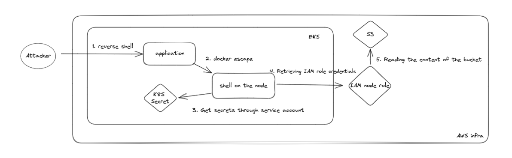

# Exercise ~ Attacking a kubernetes cluster

Welcome to this Dojo !
Your goal is to exploit this kubernetes cluster to understand the risks linked to a non secure cluster implementation, and learn the maximum during this session.

That's why it is essential that:

- You experiment and try things that may break. Don't simply copy paste everything from StackOverflow until it passes the test !
- To keep moving or learn more, please _andon_! It means then whenever you have a question, a doubt, a feedback, call someone from the staff, we'll love to help you.

## Setup your env

First, you need to setup your computer for the dojo.

Start with cloning this repo:

```bash
git clone https://github.com/padok-team/kubesecu-lab-cours
cd kubesecu-lab-cours
```

### Connect to a distant VM

To work efficiently, you will work on a distant VM on which all the following tools are already installed.

- `git`: Version your code and collaborate
- [`aws CLI`](https://docs.aws.amazon.com/fr_fr/cli): The CLI to interact with AWS.
- [`kubectl`](https://docs.aws.amazon.com/fr_fr/cli): The CLI to interact with AWS.

To connect to the VM:

- Install VSCode
- Add the following [Remote SSH extension](https://code.visualstudio.com/docs/remote/ssh) to VSCode

- Create a github account
- Create a SSH key on your Github account: [Add a ssh key documentation](https://docs.github.com/en/authentication/connecting-to-github-with-ssh/generating-a-new-ssh-key-and-adding-it-to-the-ssh-agent)
- Share your handle Github with Padok's team member

- Launch a "Remote SSH Session" with VSCode extension via the command `ssh eleve@<Handle>.aws.padok.cloud`

### Bootstrap the environment

To create the insecure infrastructure, follow these steps:

```bash
chmod +x access-deployments.sh
./access-deployments.sh

```

## Let's attack it !
Ready? Set. Go!

### Step 1 : Exploit the app

Check what the app contains and search how you can exploit the vulnerability.


<details>
  <summary>Hint 1</summary>

  How can you interact with the server ?
</details>

<details>
  <summary>Hint 2</summary>

  Try searching for ways to trigger a reverse shell with an image uploader. Check for CVE.

</details>

<details>
  <summary>Hint 3</summary>

  Have you heard of imagemagick ?
</details>

<details>
  <summary>Hint 4</summary>

  Check the CVE-2016-3714
</details>

<details>
  <summary>Hint 5</summary>

  Do you know how to trigger a reverse shell ?
  ```bash
  Use nc -n -l -vvv -p <port>
  ```
</details>

<details>
  <summary>Solutions Step 1</summary>
  Listen to incoming connections by performing a :
  ```bash
  nc -n -l -vvv -p 443
  ```
  Perform a reverse shell by uploading the file :

* [solutions/step1/exploit.mvg](solutions/step1/exploit.mvg)
* [solutions/step1/solution.sh](solutions/step1/solution.sh)
</details>

### Step 2 : Pod access

<details>
  <summary>Hint 1</summary>

  With what rights are you executing on the pod ?
</details>

<details>
  <summary>Hint 2</summary>
  Check the capabilities of the pod with capsh --print
</details>

<details>
  <summary>Hint 3</summary>
  
  Have you heard of container escape ?
</details>

<details>
  <summary>Hint 4</summary>
  
  Check how you can use the command nsenter to escape a container.
</details>

<details>
  <summary>Solutions Step 2</summary>
  Check the capabilities of the container.
  Use nsenter to perform the container escape.

  [solutions/step2/solution.sh](solutions/step2/solution.sh)
</details>

## First attack scenario
### Step 3 : First exploit on the node : Retrieve the secret flag from the cluster

<details>
  <summary>Hint 1</summary>
  
  What is hosted on a kubernetes node ?
  What could you possibly list from the node ?
</details>

<details>
  <summary>Hint 2</summary>
  
  Use the mount command to list what is mounted on the node. Do you observe potentially sensitive things ?
</details>

<details>
  <summary>Hint 3</summary>
  
  You need a token and the right API url to interact with the cluster 
</details>

<details>
  <summary>Hint 4</summary>
  
  Try to grep the mount command with "api"
</details>

<details>
  <summary>Hint 5</summary>
  
  Check in the environment variables if you can possibly find an interesting ip
</details>

<details>
  <summary>Hint 6</summary>
  
  How can you use the token and the ip to connect to the kubernetes API ?
  Try to check the manual of kubectl.
</details>

<details>
  <summary>Solutions Step 3</summary>
  Try each token to get the secrets on the cluster.
  You can use a for loop to iterate on each token to check which one has the rights to display the secrets.

  [solutions/step3/solution.sh](solutions/step3/solution.sh)
</details>

## Second attack scenario
### Step 4 : Second exploit on the node : Access to a protected s3 bucket

<details>
  <summary>Hint 1</summary>
  
  Check how you can retrieve the metadata of an instance in AWS.
</details>

<details>
  <summary>Hint 2</summary>

  Check the metadata you obtain using the command in the following file. Maybe take a look at superior level metadata.
  [documentation-metadata]https://docs.aws.amazon.com/fr_fr/AWSEC2/latest/UserGuide/instancedata-data-retrieval.html
</details>

<details>
  <summary>Hint 3</summary>
  
  What we want at this point is to get the AWS credentials to get the rights of the iam node-group role. You can retrieve the aws credentials from the json generated by the curl command. Be careful because the aws credentials syntax is different than the response obtained from the command
</details>

<details>
  <summary>Hint 4</summary>
  
  You can use the [python script](solutions/step4/export-credentials-aws.py) located in the solutions/step4 folder. Do not cheat by checking the solution ;).
</details>

<details>
  <summary>Hint 5</summary>
  
  Export the values from the script output. You should be able now to use ./kubectl get pods
</details>

<details>
  <summary>Solutions Step 4</summary>
  
  Slowly retrieve the metadata starting with the lowest level provided in the documentation on Hint 2.
  Iterate slowly on higher level :
  ```bash
  TOKEN=`curl -X PUT "http://169.254.169.254/latest/api/token" -H "X-aws-ec2-metadata-token-ttl-seconds: 21600"` && curl -H "X-aws-ec2-metadata-token: $TOKEN" -v http://169.254.169.254/latest/meta-data

  TOKEN=`curl -X PUT "http://169.254.169.254/latest/api/token" -H "X-aws-ec2-metadata-token-ttl-seconds: 21600"` && curl -H "X-aws-ec2-metadata-token: $TOKEN" -v http://169.254.169.254/latest/meta-data/iam

  TOKEN=`curl -X PUT "http://169.254.169.254/latest/api/token" -H "X-aws-ec2-metadata-token-ttl-seconds: 21600"` && curl -H "X-aws-ec2-metadata-token: $TOKEN" -v http://169.254.169.254/latest/meta-data/iam/security-credentials

  TOKEN=`curl -X PUT "http://169.254.169.254/latest/api/token" -H "X-aws-ec2-metadata-token-ttl-seconds: 21600"` && curl -H "X-aws-ec2-metadata-token: $TOKEN" -v http://169.254.169.254/latest/meta-data/iam/security-credentials/app-eks-node-group-20230105092937095600000002
  ```
  Extract the result of the last command to a json file and use the [python script](solutions/step4/export-credentials-aws.py) to obtain the export command to implement the aws credentials on your machine.

  Now try a kubectl get pods command to be sure you have now the aws access. 

  [solutions/step4/solution.sh](solutions/step4/solution.sh)
</details>

### Step 5 : Retrieve the flag from the bucket

Your goal is to get the flag contained on a bucket.  

<details>
  <summary>Hint 1</summary>
  
  You are using the role policy of a node group. This role has several policies.
</details>

<details>
  <summary>Hint 2</summary>
  Check the documentation of the s3api aws cli reference.
</details>

<details>
  <summary>Hint 3</summary>
  The policies allowed for the role are "s3:ListBucket" and "s3:GetObject". It allows you to list the buckets and get the objects they contains.
</details>

<details>
  <summary>Solutions Step 5</summary>

  You must list the buckets existing with the command. There is just one bucket existing.
  You can then list the files contained on the s3 bucket.
  Get the flag in the bucket
  [solution/step5/solution.sh](solutions/step5/solution.sh)
</details>




# LICENSE

© 2023 [Padok](https://www.padok.fr/).

Licensed under the [Apache License](https://www.apache.org/licenses/LICENSE-2.0), Version 2.0 ([LICENSE](./LICENSE))
